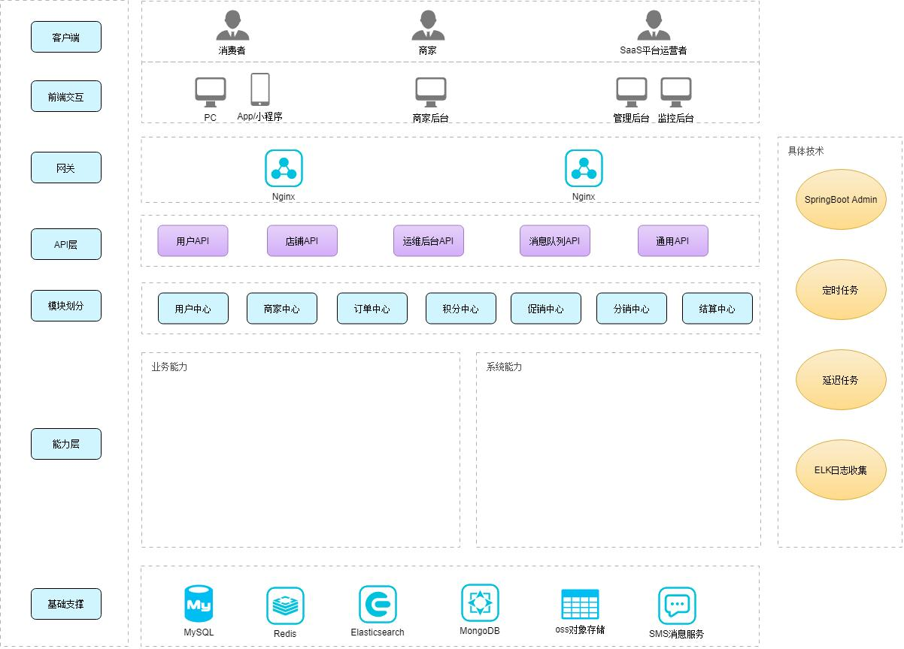

# mall

## source

- https://github.com/macrozheng/mall

## structure

- pms：商品管理模块
- oms：订单管理模块
- sms：秒杀、营销管理模块
- cms：优选、话题模块
- ums：客户模块

# onemall

## source

- https://github.com/YunaiV/onemall

## structure

**api**

- rpc

  存储**app**的**rpc**类的**接口**

**app**

> 以下都包含**多个文件夹**，每个实体类对应一个文件夹

- convert[kənˈvɜːt]转变

  BO**转换**为DO的各种**接口方法**

- dal.mysql 或 dal.esx

  - dataobject

    保存DO**领域**对象

  - mapper

    保存Mybatis-Plus的方法

- service

  每个实体类文件夹**又**可以包含**BO**业务对象

  每个类都**引入Mapper**

  service没有**接口**

- manager

  相当于**Controller**，每个类都**引入Service**

- rpc

  rpc接口实现类，每个类都**引入Manager**

  rpc暴露接口

**knowledge**

- app的service去除了接口
- app的**rpc**提供具体实现，web的**service**进行调用

**web**

> 以下都包含**多个文件夹**，每个项目的**module**对应一个文件夹

- client

- convert

  存储**DTO**和**VO**相互转换的方法

- service

  每个类都调用某个**module**的**rpc**

- controller

  每个类都引入**service**的**Manager**


## 代码生成器

- dal.sql的dataobject：使用连接数据库，生成表名+DO的实体类

- dal.sql的mapper和：使用连接数据库，生成拥有表名的Mapper类和xml

  以上可以使用Mybatis-Plus的代码生成器，但是去除Controller和Service，且实体类添加DO

- service：使用连接数据库，生成拥有表名的不implement的Service类

- manager：使用连接数据库，生成拥有表名且添加@Service的Manager类


- Mybatis-Plus：DO和mapper移动到dataobject和mapper下的**

  生成器：在convert的***生成实体类名的Convert
  在service的***生成bo+实体类名BO，添加@Data
  在rpc的***生成dto+实体类DTO，添加@Data

  数据库实体类继承
  数据库为bit类型，把DO的Boolean改为Integer

## 实体类thingking

**实体类传递过程**

- rpc <=> manager <=> service <=> mapper

  ​             controller <=> service <=> mapper

  **使用manager代替controller来操作BO**

  在onemall项目上，也可以使用与manager同级别的controller，操作BO，返回VO

- 查询操作

  ReqDTO <=> (DO -> BO -> RespDTO)

- 非查询操作

  ReqDTO <=> (BO -> DO) 

  如果不用Rpc框架，一般只需要DO和BO

  而过去项目操作单表只使用DO，操作多表使用DO + BO

**各个包操作何种实体类**

- rpc接收ReqDTO 、返回RespDTO
- manager操作得到BO，返回RespDTO
- service操作得到DO，返回BO
- controller操作得到RespDTO，返回RespVO

**理想状态的实体类对象**

- DO

- BO

  操作多表

- VO

  统一前端接收数据，否则前端返回DO，而数据库表增加了字段，将导致前端多接收了该字段数据


#mall4cloud

## source

- https://github.com/gz-yami/mall4cloud

## structure

```lua
mall4cloud
├─mall4cloud-api -- 内网接口
│  ├─mall4cloud-api-auth  -- 授权对内接口
│  ├─mall4cloud-api-biz  -- biz对内接口
│  ├─mall4cloud-api-leaf  -- 美团分布式id生成接口
│  ├─mall4cloud-api-multishop  -- 店铺对内接口
│  ├─mall4cloud-api-order  -- 订单对内接口
│  ├─mall4cloud-api-platform  -- 平台对内接口
│  ├─mall4cloud-api-product  -- 商品对内接口
│  ├─mall4cloud-api-rbac  -- 用户角色权限对内接口
│  ├─mall4cloud-api-search  -- 搜索对内接口
│  └─mall4cloud-api-user  -- 用户对内接口
├─mall4cloud-auth  -- 授权校验模块
├─mall4cloud-biz  -- mall4cloud 业务代码。如图片上传/短信等
├─mall4cloud-common -- 一些公共的方法
│  ├─mall4cloud-common-cache  -- 缓存相关公共代码
│  ├─mall4cloud-common-core  -- 公共模块核心（公共中的公共代码）
│  ├─mall4cloud-common-database  -- 数据库连接相关公共代码
│  ├─mall4cloud-common-order  -- 订单相关公共代码
│  ├─mall4cloud-common-product  -- 商品相关公共代码
│  ├─mall4cloud-common-rocketmq  -- rocketmq相关公共代码
│  └─mall4cloud-common-security  -- 安全相关公共代码
├─mall4cloud-gateway  -- 网关
├─mall4cloud-leaf  -- 基于美团leaf的生成id服务
├─mall4cloud-multishop  -- 商家端
├─mall4cloud-order  -- 订单服务
├─mall4cloud-payment  -- 支付服务
├─mall4cloud-platform  -- 平台端
├─mall4cloud-product  -- 商品服务
├─mall4cloud-rbac  -- 用户角色权限模块
├─mall4cloud-search  -- 搜索模块
└─mall4cloud-user  -- 用户服务
```


# pig

## source

- https://github.com/pig-mesh/pig

## structure

```lua
pig-ui  -- https://gitee.com/log4j/pig-ui

pig
├── pig-auth -- 授权服务提供[3000]
└── pig-common -- 系统公共模块
     ├── pig-common-bom -- 全局依赖管理控制
     ├── pig-common-core -- 公共工具类核心包
     ├── pig-common-datasource -- 动态数据源包
     ├── pig-common-job -- xxl-job 封装
     ├── pig-common-log -- 日志服务
     ├── pig-common-mybatis -- mybatis 扩展封装
     ├── pig-common-security -- 安全工具类
     ├── pig-common-swagger -- 接口文档
     ├── pig-common-feign -- feign 扩展封装
     └── pig-common-test -- oauth2.0 单元测试扩展封装
├── pig-register -- Nacos Server[8848]
├── pig-gateway -- Spring Cloud Gateway网关[9999]
└── pig-upms -- 通用用户权限管理模块
     └── pig-upms-api -- 通用用户权限管理系统公共api模块
     └── pig-upms-biz -- 通用用户权限管理系统业务处理模块[4000]
└── pig-visual
     └── pig-monitor -- 服务监控 [5001]
     ├── pig-codegen -- 图形化代码生成 [5002]
     ├── pig-sentinel-dashboard -- 流量高可用 [5003]
     └── pig-xxl-job-admin -- 分布式定时任务管理台 [5004]
```


# lilishop

## source

- https://github.com/lilishop/lilishop

## structure

```lua
admin
byer-api
config
consumer
framework
manager-api
seller-api
xxl-job
```



# linkwechat

## source

- https://gitee.com/LinkWeChat/link-wechat

## structure

```lua
com.linkwechat     
├── common            // 工具类
│       └── annotation                    // 自定义注解
│       └── config                        // 全局配置
│       └── constant                      // 通用常量
│       └── core                          // 核心控制
│       └── enums                         // 通用枚举
│       └── exception                     // 通用异常
│       └── filter                        // 过滤器处理
│       └── utils                         // 通用类处理
├── framework         // 框架核心
│       └── aspectj                       // 注解实现
│       └── config                        // 系统配置
│       └── datasource                    // 数据权限
│       └── interceptor                   // 拦截器
│       └── listener                      // Redis监听者
│       └── manager                       // 异步处理	
│       └── security                      // 权限控制
│       └── web                           // 前端控制
├── linkwe-generator   // 代码生成
├── linkwe-quartz      // 定时任务
├── linkwe-system      // 系统代码
├── linkwe-admin       // 后台服务
├── linkwe-ui          // 页面前端代码
├── linkwe--wecom      // 企业微信功能
│       └── client // Forest接口，存储其他服务的访问接口
│       └── handler // 转换处理器
│       └── interface // 拦截器，存储其他服务被调用前，执行相应的前置通知
```

## knowledge

- 一个ThreadLocal对象就可保存**多个**线程的变量
- iBatis也是持久层框架


# swaw


# seckill

## source

- https://github.com/lyrric/seckill

## thinking

- **why可以实现秒杀增强**
  - 源程序只使用一个线程进行秒杀，而seckill使用多线程
    - 多线程比单线程来说，有更大的**机率**秒杀成功
    - 在源程序的刷新也可以实现多线程，但每次刷新都会**获取**除了秒杀逻辑其他的数据，造成达到秒杀逻辑的时间**延长**，而seckill的线程更具有针对性
    - 多线程触发服务器的**防重复提交**也不碍事，发生该事件，说明在服务器上的秒杀逻辑已经触发
  - 源程序在点击秒杀后才获取服务器的时间戳，而seckill提前获取时间戳